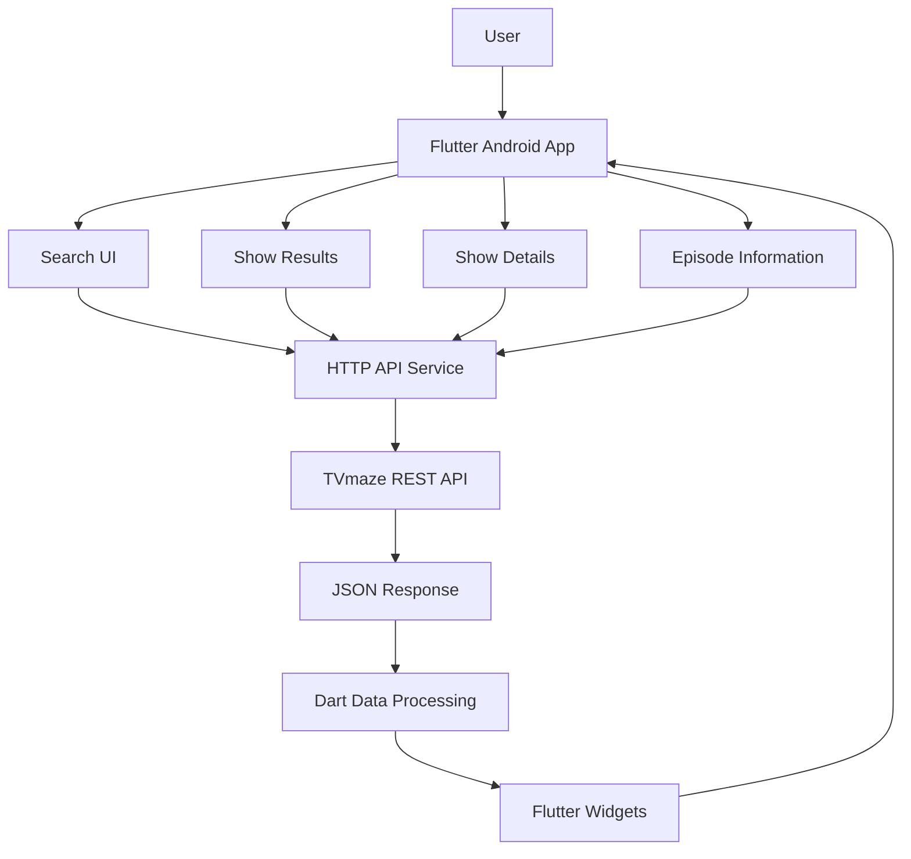

# TeleShow

### TV Show Discovery App built with Flutter & TVmaze API

TeleShow is a modern **Android TV show discovery application** built using **Flutter and Dart**. The application connects with the **TVmaze REST API** to retrieve dynamic TV show information and presents it through a clean, responsive, and easy-to-navigate mobile interface.

The application allows users to search for TV shows and explore detailed information including **ratings, genres, release dates, descriptions, posters, episodes, seasons, cast, crew, schedules, and other available show metadata**.

TeleShow is designed as a **discovery and information platform**, not a video streaming application.

---

## Project Status

**MVP — Active Development**

The current MVP focuses on:

* TV show discovery
* Search functionality
* External REST API integration
* Dynamic JSON data processing
* Show detail screens
* Ratings and genres
* Release information
* Posters and images
* Episode information
* Responsive Flutter UI
* Android application support

Future releases can extend the MVP with personalized features such as favorites, watchlists, recommendations, filtering, and watch history.

---

## Overview

Finding information about TV shows often requires switching between multiple platforms. TeleShow provides a simple interface where users can search for a TV show and explore its available information from a single application.

The application communicates with the TVmaze API, receives JSON responses, converts the response data into usable application models, and dynamically renders the information through Flutter widgets.

### Core Flow

```text
User
  │
  ▼
Flutter Android Application
  │
  ├── Search
  │
  ├── Show Results
  │
  └── Show Details
          │
          ▼
      HTTP Request
          │
          ▼
     TVmaze REST API
          │
          ▼
       JSON Response
          │
          ▼
   Dart Data Processing
          │
          ▼
    Dynamic Flutter UI
```

---

# Key Features

## TV Show Search

Users can search for TV shows and retrieve matching results dynamically from the TVmaze API.

The search experience is designed to keep the application lightweight while allowing users to discover a wide range of television content.

### Search capabilities

* Search by show name
* API-powered results
* Dynamic result rendering
* Show poster/image display
* Show title and basic metadata
* Open selected show for detailed information

---

## Show Details

Each selected show can display detailed information retrieved from the API.

Depending on the available TVmaze data, the application can present:

* Show title
* Description
* Rating
* Genres
* Language
* Country
* Premiere/release date
* Runtime
* Network information
* Official/show URL
* Poster/image
* Status
* Schedule information

---

## Episode Information

TeleShow can retrieve episode-related information available through TVmaze.

Episode information can include:

* Episode name
* Season number
* Episode number
* Air date
* Air time
* Episode runtime
* Episode summary
* Episode image

This makes the application useful not only for discovering shows but also for exploring their episode structure.

---

## Dynamic API Data

TeleShow does not rely on a hardcoded TV show catalog.

The application retrieves information dynamically from the TVmaze API.

```text
Flutter App
     │
     │ HTTP Request
     ▼
TVmaze API
     │
     │ JSON
     ▼
Dart Model / Data Processing
     │
     ▼
Flutter Widgets
     │
     ▼
User Interface
```

This demonstrates how a real Flutter application can consume and render data from an external REST service.

---

# Technology Stack

| Technology  | Purpose                              |
| ----------- | ------------------------------------ |
| Flutter     | Cross-platform application framework |
| Dart        | Application programming language     |
| TVmaze API  | TV show data provider                |
| REST API    | External data communication          |
| HTTP        | API requests                         |
| JSON        | API response format                  |
| Material UI | Application interface                |
| Android     | Primary target platform              |
| Git         | Version control                      |
| GitHub      | Source code hosting                  |

---

# API Integration

TeleShow uses the **TVmaze REST API** as its external data source.

TVmaze provides structured information about television shows, episodes, seasons, cast, crew, schedules, images, and other show metadata.

### API Data Flow

```text
User Search
     │
     ▼
Flutter Search Interface
     │
     ▼
HTTP API Request
     │
     ▼
TVmaze REST API
     │
     ▼
JSON Response
     │
     ▼
Dart JSON Processing
     │
     ▼
Flutter UI
```

The application processes the returned JSON data and converts it into UI-friendly information.

---

# Application Architecture

TeleShow follows a simple API-driven Flutter architecture.



---

# Application Modules

## 1. Search Module

Responsible for:

* Taking user search input
* Sending API requests
* Processing search results
* Displaying matching shows
* Handling empty results

---

## 2. Show Discovery Module

Responsible for:

* Displaying available shows
* Showing posters
* Displaying basic metadata
* Navigating to show details

---

## 3. Show Details Module

Responsible for:

* Show title
* Description
* Genres
* Rating
* Release information
* Images
* Other available metadata

---

## 4. Episode Module

Responsible for presenting episode-level information retrieved from the API.

---

## 5. API Integration Module

Responsible for:

* HTTP requests
* API response handling
* JSON processing
* Error handling
* Converting remote data into application data

---

# User Experience

TeleShow focuses on keeping the discovery experience simple.

### Typical user journey

```text
Open TeleShow
      │
      ▼
Search for a TV Show
      │
      ▼
View Search Results
      │
      ▼
Select a Show
      │
      ▼
View Show Details
      │
      ▼
Explore Episodes
```

The application avoids unnecessary complexity and focuses on helping users reach TV show information quickly.

---

# UI & Design

TeleShow uses Flutter's Material UI system to create a modern Android interface.

### UI principles

* Clean layout
* Responsive widgets
* Readable typography
* Image-focused content
* Simple navigation
* Clear information hierarchy
* Mobile-friendly interaction
* Dynamic content rendering

The interface is designed around the content provided by the API rather than a fixed static catalog.

---

# Data Handling

TVmaze responses are delivered in JSON format.

A simplified data flow looks like:

```text
JSON Response
      │
      ▼
Dart Parsing
      │
      ▼
Application Data
      │
      ├── Title
      ├── Rating
      ├── Genres
      ├── Description
      ├── Images
      ├── Release Date
      └── Episodes
              │
              ▼
        Flutter Widgets
```

This approach demonstrates practical handling of external structured data in a Flutter application.

---

# Error Handling

A production-oriented version of the application should handle common API conditions gracefully.

### Possible states

* Loading state
* Successful response
* Empty search results
* Invalid search
* Missing show image
* Missing description
* Missing rating
* API/network failure
* Unexpected API response

The UI should avoid breaking when optional TVmaze fields are unavailable.

---

# Project Structure

A scalable TeleShow project can be organized as follows:

```text
teleshow_app/
│
├── android/
│
├── ios/
│
├── web/
│
├── lib/
│   │
│   ├── main.dart
│   │
│   ├── models/
│   │   └── show_model.dart
│   │
│   ├── services/
│   │   └── tvmaze_api_service.dart
│   │
│   ├── screens/
│   │   ├── home_screen.dart
│   │   ├── search_screen.dart
│   │   ├── show_details_screen.dart
│   │   └── episodes_screen.dart
│   │
│   ├── widgets/
│   │   ├── show_card.dart
│   │   ├── rating_widget.dart
│   │   └── episode_card.dart
│   │
│   └── utils/
│
├── assets/
│
├── pubspec.yaml
├── pubspec.lock
└── README.md
```

> The exact directory names may differ depending on the current implementation. The structure above represents a scalable organization for the TeleShow MVP.

---

# REST API Integration

TeleShow's API layer can be organized around the TVmaze endpoints required by the application.

### Core operations

| Operation    | Purpose                                 |
| ------------ | --------------------------------------- |
| Show Search  | Find shows by name                      |
| Show Details | Retrieve complete show information      |
| Episodes     | Retrieve episode information            |
| Images       | Retrieve show/episode artwork           |
| Schedule     | Retrieve available schedule information |
| Cast/Crew    | Retrieve available people information   |

The application only consumes the data required by its UI and does not operate its own TV content database.

---

# Why TVmaze?

TVmaze is suitable for this project because it provides structured TV metadata through a REST API.

Available information includes:

* Shows
* Episodes
* Seasons
* Cast
* Crew
* Schedules
* Images
* Ratings
* Genres
* Network information
* Show metadata

This makes TVmaze a useful external data source for demonstrating real-world API integration in Flutter.

---

# Security & Privacy

TeleShow's current MVP is primarily an API-driven discovery application and does not require user authentication for its core functionality.

Important security practices for future versions include:

* Avoid storing unnecessary personal data
* Do not hardcode private API credentials
* Validate external API responses
* Handle malformed JSON safely
* Use HTTPS for external API communication
* Avoid exposing sensitive configuration
* Keep third-party dependencies updated

Since the current application does not require a custom authentication backend, there is no unnecessary user-account infrastructure in the MVP.

---

# Performance Considerations

The application can be optimized through:

* Efficient API calls
* Debounced search requests
* Image caching
* Lazy list rendering
* Lightweight Dart models
* Avoiding unnecessary widget rebuilds
* Proper loading states
* Network error handling

These optimizations become especially useful when users perform multiple searches or browse large result sets.

---

# MVP Scope

The current MVP demonstrates the core functionality required for a TV discovery application.

### Included

* [x] Flutter Android application
* [x] Dart development
* [x] TVmaze REST API integration
* [x] HTTP requests
* [x] JSON data processing
* [x] TV show search
* [x] Dynamic show results
* [x] Show details
* [x] Ratings
* [x] Genres
* [x] Release information
* [x] Posters/images
* [x] Episode information
* [x] Responsive Material UI

### Not part of the current MVP

* [ ] Video streaming
* [ ] User authentication
* [ ] Custom backend
* [ ] PostgreSQL database
* [ ] Personalized user profiles
* [ ] Subscription/payment system

Keeping these outside the MVP keeps the project focused on its primary objective: **TV show discovery through a real external API**.

---

# Future Roadmap

TeleShow can be expanded into a more complete TV discovery platform.

## Phase 1 — Discovery Improvements

* [ ] Trending shows
* [ ] Popular shows
* [ ] Advanced search
* [ ] Genre filtering
* [ ] Rating filtering
* [ ] Year filtering
* [ ] Sorting options
* [ ] Improved pagination

## Phase 2 — Personalization

* [ ] Favorites
* [ ] Watchlist
* [ ] Watch history
* [ ] Recently viewed shows
* [ ] Personalized recommendations
* [ ] User preferences

## Phase 3 — Content Experience

* [ ] Trailer integration
* [ ] Cast profiles
* [ ] Crew information
* [ ] Season-wise episode navigation
* [ ] Episode tracking
* [ ] Similar/recommended shows

## Phase 4 — User Accounts

A future version could introduce:

* User registration
* Login
* Cloud watchlists
* Cross-device synchronization
* User profiles

A custom backend such as FastAPI could be introduced at this stage if persistent user data becomes necessary.

## Phase 5 — Advanced Platform

Potential long-term features:

* Recommendation engine
* AI-powered show recommendations
* Notification system
* New episode alerts
* Multi-language support
* Offline metadata caching
* Advanced analytics
* Cloud synchronization

---

# Technical Learning Outcomes

TeleShow demonstrates practical knowledge of:

### Flutter Development

* Widget-based UI development
* Navigation
* Material UI
* Responsive layouts
* Dynamic list rendering

### Dart

* Classes and objects
* Async/await
* Futures
* JSON parsing
* API data models
* Null-safe programming

### REST APIs

* HTTP requests
* Endpoint integration
* Query parameters
* JSON responses
* Error handling

### Application Architecture

* Separation of UI and API logic
* Reusable widgets
* Data models
* Service-layer design
* Dynamic content rendering

---

# Deployment

The application is primarily designed for Android.

Future deployment targets can include:

```text
Flutter Application
       │
       ├── Android
       │     └── APK / App Bundle
       │
       ├── iOS
       │
       └── Web
```

For Android distribution, the application can be packaged as an APK or Android App Bundle and distributed through appropriate channels such as Google Play.

---

# Development Workflow

The project follows a standard software development workflow:

```text
Feature Idea
     │
     ▼
Flutter Implementation
     │
     ▼
API Integration
     │
     ▼
UI Testing
     │
     ▼
Bug Fixes
     │
     ▼
Git Commit
     │
     ▼
GitHub Repository
```

Git and GitHub are used for source control and project version management.

---

# Testing Checklist

Before releasing a new version, the following areas should be verified:

### Search

* [ ] Search returns relevant results
* [ ] Empty search is handled
* [ ] No-result state is displayed correctly
* [ ] Multiple searches work correctly

### Show Details

* [ ] Title loads correctly
* [ ] Poster loads correctly
* [ ] Rating is displayed correctly
* [ ] Genres are displayed correctly
* [ ] Description renders correctly
* [ ] Release information is available

### Episodes

* [ ] Episode data loads correctly
* [ ] Season/episode numbers are correct
* [ ] Episode summaries render correctly
* [ ] Missing episode images do not break the UI

### Network

* [ ] Loading state works
* [ ] API failure is handled
* [ ] Slow network is handled
* [ ] Invalid/missing API fields are handled

### UI

* [ ] Different screen sizes are tested
* [ ] Long titles do not break layouts
* [ ] Images fail gracefully
* [ ] Navigation works correctly

---

# Advantages of the Project

TeleShow is intentionally simple in its MVP architecture, but it demonstrates several real-world development concepts.

### Real API Integration

Instead of using only static or hardcoded data, TeleShow communicates with an external TV database API.

### Dynamic UI

The interface changes according to the data returned by the API.

### Scalable Architecture

The application can later introduce authentication, databases, recommendations, and additional services without changing its core discovery concept.

### Practical Flutter Project

The project demonstrates how Flutter can be used to build a complete API-driven Android application rather than only static UI screens.

---

# Limitations

The current MVP has some intentional limitations:

* No video streaming
* No user account system
* No cloud watchlist
* No personalized recommendations
* No custom backend
* No persistent user database
* Dependent on TVmaze API availability
* External API data determines the available show metadata

These limitations keep the current version focused and lightweight.

---

# Project Architecture — Current vs Future

```text
CURRENT MVP

Flutter
   │
   ▼
TVmaze REST API
   │
   ▼
JSON
   │
   ▼
Flutter UI
```

```text
FUTURE EXTENDED VERSION

Flutter
   │
   ▼
Application Backend
   │
   ├── Authentication
   ├── User Profiles
   ├── Favorites
   ├── Watchlist
   ├── Recommendations
   └── Notifications
          │
          ▼
       Database
          │
          ▼
     TVmaze API
```

This allows TeleShow to evolve from a learning-focused API project into a complete TV discovery platform.

---

# Project Objective

The primary objective of TeleShow is to demonstrate the development of a practical Flutter application that communicates with a real-world REST API.

The project focuses on:

* Flutter application development
* Dart programming
* REST API integration
* JSON data processing
* Dynamic UI rendering
* Mobile application architecture
* External data consumption
* Responsive Android UI

---

# Repository

**Project:** TeleShow

**Platform:** Android

**Framework:** Flutter

**Language:** Dart

**Data Provider:** TVmaze API

**Project Type:** Independent Learning & Development Project

---

# Developer

**Sumit Singh**

BCA Student & Flutter Developer

* GitHub: [Sumit-singh2398](https://github.com/Sumit-singh2398)
* LinkedIn: [Sumit Singh](https://www.linkedin.com/in/sumit-singh-975b7b412/)

---

# License

This project is currently maintained as an independent academic and portfolio project.

A formal open-source license can be added in the future if the repository is intended for public reuse and contribution.

---

# Disclaimer

TeleShow is an independent application created for learning and development purposes.

TV show information is retrieved from the **TVmaze API**. TeleShow does not host, distribute, or stream copyrighted television content.

The application is intended for **TV show discovery and information purposes only**.

---

## Final Summary

TeleShow is a Flutter-based Android TV show discovery application that combines a modern mobile interface with real-time data from the TVmaze REST API.

The project demonstrates the complete flow of:

**User Search → REST API → JSON Response → Dart Processing → Dynamic Flutter UI**

While the current version focuses on TV show discovery, its architecture provides a foundation for future features such as watchlists, favorites, recommendations, episode tracking, notifications, and personalized content discovery.
